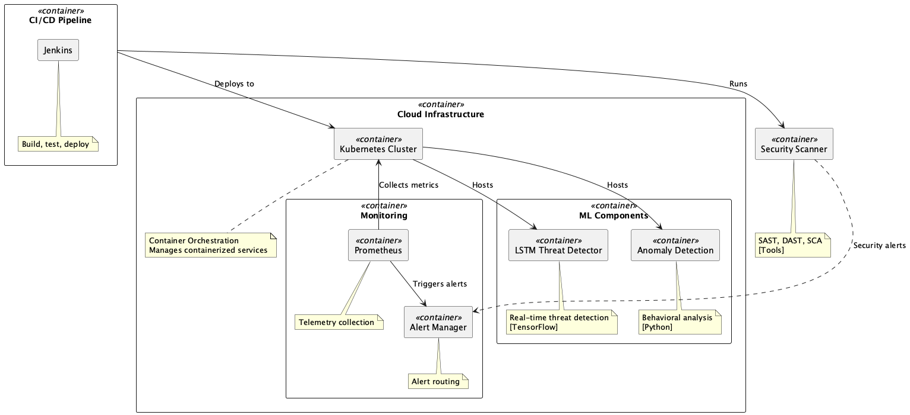

# AI-Augmented DevSecOps Framework

An AI-enhanced security automation framework for cloud-native applications, featuring real-time threat detection and automated response capabilities.

## 🚀 Features

- Real-time threat detection using LSTM neural networks
- Automated security policy enforcement
- Integration with Kubernetes and cloud platforms
- Prometheus metrics and monitoring
- CI/CD pipeline with Jenkins integration

## 📋 Prerequisites

- Python 3.8+
- Docker 20.10+
- Kubernetes cluster 1.19+
- Jenkins 2.3x+
- Prometheus 2.30+
- Helm 3.x+
- kubectl 1.19+
- Access to a container registry
- At least 4GB RAM and 2 CPU cores

## 🏃‍♂️ Quick Start

1. Clone the repository:
```bash
git clone https://github.com/akshaymittal143/ai-devsecops-framework.git
cd ai-devsecops-framework
```

2. Install dependencies:
```bash
python -m venv venv
source venv/bin/activate  # On Windows: venv\Scripts\activate
pip install -r requirements.txt
```

3. Configure the environment:
```bash
cp config/settings.example.yaml config/settings.yaml
# Edit config/settings.yaml with your settings
```

4. Start the services:
```bash
docker-compose up -d
kubectl apply -f deploy/
```

## 🏗 Architecture

### High-Level System Architecture



The system architecture shows the main components:
- LSTM-based threat detection
- Kubernetes integration
- Prometheus monitoring
- CI/CD pipeline

### Data Flow


Illustrates how data flows through:
- Git repository
- Jenkins pipeline
- Security scanners
- Production environment

### Security Model


Shows the security components:
- WAF integration
- Policy enforcement
- Access control
- Monitoring systems

## 📊 Performance

Current model performance:
- Precision: 0.93
- Recall: 0.95
- F1 Score: 0.94

For detailed results, see [models/results.md](models/results.md)

## 🛠 Development

### Generate Architecture Diagrams

1. Install PlantUML:
```bash
brew install plantuml
```

2. Generate diagrams:
```bash
cd docs/architecture
plantuml *.puml
```

3. Diagrams will be created as PNG files in the same directory

## 📝 Documentation

### Key Components

#### ML Components
- LSTM-based threat detection
- Anomaly detection engine
- Real-time prediction service

#### Security Controls
- Web Application Firewall (WAF)
- Policy enforcement engine
- Access control system

#### Monitoring
- Prometheus metrics collection
- Alert Manager for security notifications
- Audit logging system

#### CI/CD Integration
- Jenkins pipeline integration
- Security scanning (SAST/DAST)
- Automated deployment

## 🤝 Contributing

Please see [CONTRIBUTING.md](CONTRIBUTING.md) for guidelines.

## 📄 License

This project is licensed under the MIT License - see the [LICENSE](LICENSE) file for details.

## 🧩 Module Overview

### Detection
- `lstm_detector.py`: LSTM-based threat detection
- `zero_day_detector.py`: Zero-day attack detection using behavioral analysis
- `attack_generator.py`: Synthetic attack scenario generation
- `engine.py`: Detection engine orchestration

### Pipeline
- `message_bus.py`: Event-driven communication
- `orchestrator.py`: Component coordination and conflict resolution
- `policy_engine.py`: Dynamic security policy generation and enforcement
- `preprocessor.py`: Data cleaning and normalization
- `k8s_integration.py`: Kubernetes API integration
- `security_gate.py`: Security validation entry point

### API
- `security_validator.py`: API fuzzing and security validation
- `test_runner.py`: API security test runner with mutation and anomaly detection

### Validation
- `business_logic_validator.py`: Business logic flaw detection

### Telemetry
- `collector.py`: Telemetry and monitoring data collection

## ⚙️ Configuration

Edit `config/settings.yaml` to customize detection thresholds, orchestration strategies, and monitoring settings:

```yaml
detection:
  model:
    type: lstm
    units: 64
    window_size: 10
  threshold:
    anomaly: 0.95
    confidence: 0.85
orchestration:
  strategy: confidence-weighted
  retry_attempts: 3
  timeout: 30s
monitoring:
  prometheus:
    scrape_interval: 15s
  logging:
    level: info
    retention: 30d
```

## 🛡️ API Usage Example

### Python (Programmatic)
```python
from src.detection.lstm_detector import LSTMDetector
from src.detection.zero_day_detector import ZeroDayDetector
from src.pipeline.policy_engine import PolicyEngine

lstm = LSTMDetector()
zero_day = ZeroDayDetector()
policy_engine = PolicyEngine()

# Train and detect
lstm.fit(X_train, y_train)
alerts = lstm.detect(X_test)
zero_day.fit(X_train, y_train)
zero_day_alerts = zero_day.detect(X_test)

# Generate and enforce policy
for alert in alerts:
    policy = policy_engine.generate_policy(alert)
    policy_engine.enforce_policy(policy)
```

### REST API (Example)
```bash
curl -X POST http://localhost:8000/api/v1/detect \
  -H 'Content-Type: application/json' \
  -d '{"data": {"network_flows": [...], "system_metrics": [...]}}'
```

## 🧑‍💻 How to Extend
- Add new detection models in `src/detection/`
- Implement new policy templates in `src/pipeline/policy_engine.py`
- Add new API endpoints in `src/api/`
- Add business rules in `src/validation/business_logic_validator.py`