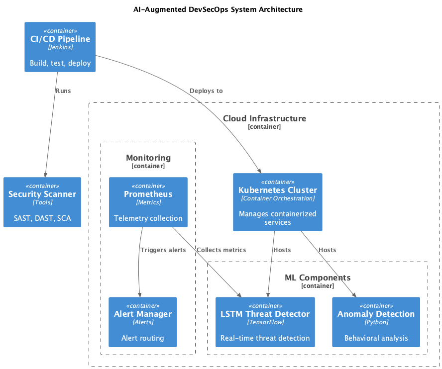
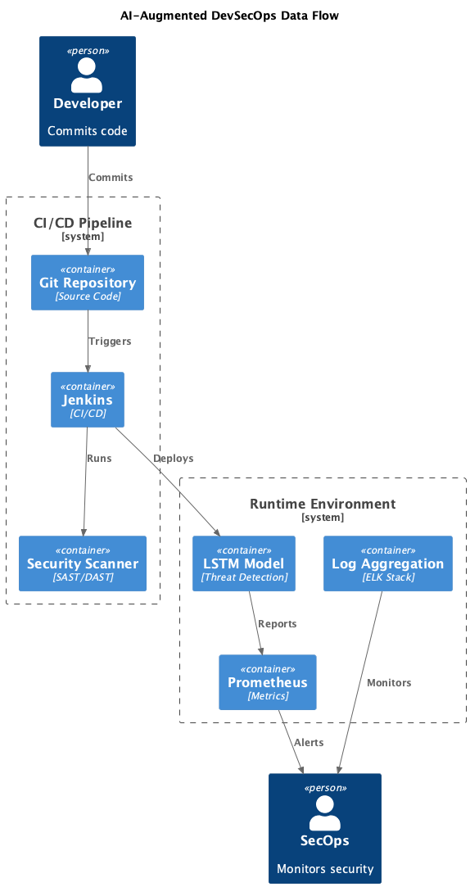
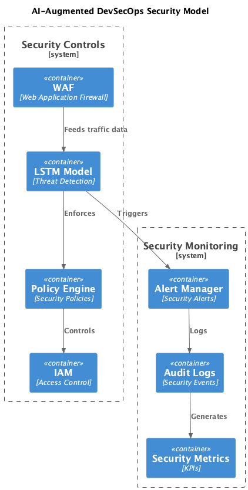

# AI-Augmented DevSecOps Framework

An AI-enhanced security automation framework for cloud-native applications, featuring real-time threat detection and automated response capabilities.

## 🚀 Features

- Real-time threat detection using LSTM neural networks
- Automated security policy enforcement
- Integration with Kubernetes and cloud platforms
- Prometheus metrics and monitoring
- CI/CD pipeline with Jenkins integration

## 📋 Prerequisites

- Python 3.8+
- Docker
- Kubernetes cluster
- Jenkins
- Prometheus

## 🏃‍♂️ Quick Start

1. Clone the repository:
```bash
git clone https://github.com/yourusername/ai-devsecops-framework.git
cd ai-devsecops-framework
```

2. Install dependencies:
```bash
pip install -r requirements.txt
```

3. Configure settings in `config/settings.yaml`

## 🏗 Architecture

### High-Level System Architecture



The system architecture shows the main components:
- LSTM-based threat detection
- Kubernetes integration
- Prometheus monitoring
- CI/CD pipeline

### Data Flow



Illustrates how data flows through:
- Git repository
- Jenkins pipeline
- Security scanners
- Production environment

### Security Model



Shows the security components:
- WAF integration
- Policy enforcement
- Access control
- Monitoring systems

## 📊 Performance

Current model performance:
- Precision: 0.93
- Recall: 0.95
- F1 Score: 0.94

For detailed results, see [models/results.md](models/results.md)

## 🛠 Development

### Generate Architecture Diagrams

1. Install PlantUML:
```bash
brew install plantuml
```

2. Generate diagrams:
```bash
cd docs/architecture
plantuml *.puml
```

3. Diagrams will be created as PNG files in the same directory

## 📝 Documentation

### Key Components

#### ML Components
- LSTM-based threat detection
- Anomaly detection engine
- Real-time prediction service

#### Security Controls
- Web Application Firewall (WAF)
- Policy enforcement engine
- Access control system

#### Monitoring
- Prometheus metrics collection
- Alert Manager for security notifications
- Audit logging system

#### CI/CD Integration
- Jenkins pipeline integration
- Security scanning (SAST/DAST)
- Automated deployment

## 🤝 Contributing

Please see [CONTRIBUTING.md](CONTRIBUTING.md) for guidelines.

## 📄 License

This project is licensed under the MIT License - see the [LICENSE](LICENSE) file for details.